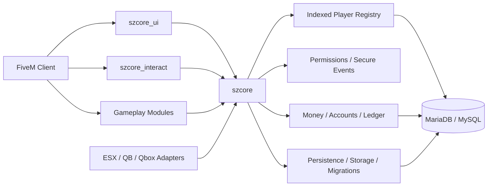

<div align="center">


<br>


<p>
  <b>An independent, modular, server-authoritative roleplay ecosystem for FiveM.</b><br>
  Built by <b>SzCode</b> for clean APIs, predictable persistence, security-first gameplay and measurable performance.
</p>

<p>
  <a href="https://github.com/Szilko121/SzCore-Framework">
    
  </a>
  
  
  
  
</p>

<p>
  <a href="https://github.com/Szilko121/SzCore-Framework/stargazers">
    
  </a>
  <a href="https://github.com/Szilko121/SzCore-Framework/forks">
    
  </a>
  <a href="https://github.com/Szilko121/SzCore-Framework/issues">
    
  </a>
  
</p>

<p>
  
  
  
  
  
</p>

<p>
  <a href="#-overview"><b>Overview</b></a> •
  <a href="#-why-szcore"><b>Features</b></a> •
  <a href="#-architecture"><b>Architecture</b></a> •
  <a href="#-ecosystem"><b>Ecosystem</b></a> •
  <a href="#-installation"><b>Installation</b></a> •
  <a href="#-developer-api"><b>API</b></a> •
  <a href="#-performance--validation"><b>Performance</b></a>
</p>

<p>
  <a href="docs/GETTING_STARTED.md"><b>Documentation</b></a> ·
  <a href="https://github.com/Szilko121/SzCore-Recipe"><b>txAdmin Recipe</b></a> ·
  <a href="CONTRIBUTING.md"><b>Contributing</b></a> ·
  <a href="SECURITY.md"><b>Security</b></a> ·
  <a href="https://github.com/Szilko121/SzCore-Framework/issues"><b>Report an Issue</b></a>
</p>

</div>

---

## 🚀 Overview

**SzCore Framework** is a next-generation FiveM roleplay foundation designed around one simple idea:

> **Keep the core small, keep gameplay modular, keep authority on the server, and measure everything that matters.**

SzCore is **not an ESX or Qbox fork**. It has its own player and character lifecycle, indexed registries, economy, groups, callbacks, hooks, permissions, persistence, inventory, vehicles, UI services and gameplay modules.

ESX, QB-Core and Qbox support is provided through **optional compatibility adapters** so legacy resources can be migrated without turning compatibility code into the framework itself.

---

## ✨ Why SzCore?

<table>
<tr>
<td width="50%" valign="top">

### ⚡ Performance-Aware
- Indexed hot-path player lookups
- Event-driven state changes
- Dirty-state persistence
- Batched database writes where safe
- Benchmark tooling included

</td>
<td width="50%" valign="top">

### 🧩 Truly Modular
- Independent resource repositories
- Optional gameplay modules
- Explicit dependencies
- Clean startup order
- Feature resources can evolve separately

</td>
</tr>
<tr>
<td width="50%" valign="top">

### 🛡️ Server-Authoritative
- Money mutations validated server-side
- Inventory changes validated server-side
- Persistent vehicle ownership on the server
- Permission and admin actions enforced server-side
- Rate limits and secure event helpers

</td>
<td width="50%" valign="top">

### 🧑‍💻 Developer-Friendly
- Exports, callbacks and hooks
- Predictable player object
- Separate compatibility adapters
- Resource-level documentation
- Migration and troubleshooting guides

</td>
</tr>
</table>

---

## 🧠 Architecture



### Core design principles

| Principle | SzCore approach |
|---|---|
| ⚡ **Hot paths** | Indexed source / citizen / license / job / gang / group lookups |
| 🔄 **State changes** | Events, callbacks and hooks instead of unnecessary polling |
| 💾 **Persistence** | Dirty tracking, batching and restart-aware recovery |
| 🛡️ **Security** | Server-side validation, permissions, rate limits and audit logging |
| 🧱 **Modularity** | Core services stay in `szcore`; gameplay lives in independent resources |
| 🔌 **Compatibility** | Legacy adapters remain optional and isolated from native APIs |

---

## 🌐 Ecosystem

SzCore currently uses **22 native resources** plus **3 optional compatibility adapters**.

<details open>
<summary><b>🧠 Foundation & Core</b></summary>

| Resource | Purpose |
|---|---|
| [`szcore`](https://github.com/Szilko121/szcore) | Core lifecycle, player registry, economy, groups, permissions, callbacks, hooks, storage, migrations, audit and metrics |
| [`szcore_ui`](https://github.com/Szilko121/szcore_ui) | Notifications, TextUI and progress interfaces |
| [`szcore_interact`](https://github.com/Szilko121/szcore_interact) | Native third-eye / target interaction system |
| [`szcore_queue`](https://github.com/Szilko121/szcore_queue) | Priority queue, reserved slots and bans |
| [`szcore_world`](https://github.com/Szilko121/szcore_world) | Ped/traffic density, dispatch, wanted and ambient-world control |
| [`szcore_benchmark`](https://github.com/Szilko121/szcore_benchmark) | Portable SzCore / ESX / Qbox benchmark suite |

</details>

<details>
<summary><b>👤 Character & Medical</b></summary>

| Resource | Purpose |
|---|---|
| [`szcore_multichar`](https://github.com/Szilko121/szcore_multichar) | Character selection and creation |
| [`szcore_spawn`](https://github.com/Szilko121/szcore_spawn) | Spawn and saved-position handling |
| [`szcore_appearance`](https://github.com/Szilko121/szcore_appearance) | Character studio and wardrobe |
| [`szcore_status`](https://github.com/Szilko121/szcore_status) | Hunger, thirst and stress |
| [`szcore_death`](https://github.com/Szilko121/szcore_death) | Injuries, bleeding, pain, last stand, death and revive |

</details>

<details>
<summary><b>💳 Economy & Organizations</b></summary>

| Resource | Purpose |
|---|---|
| [`szcore_banking`](https://github.com/Szilko121/szcore_banking) | Player banking and transaction history |
| [`szcore_billing`](https://github.com/Szilko121/szcore_billing) | Player and society invoices |
| [`szcore_society`](https://github.com/Szilko121/szcore_society) | Boss/organization management and society accounts |
| [`szcore_paycheck`](https://github.com/Szilko121/szcore_paycheck) | Duty-aware paycheck processing |
| [`szcore_inventory`](https://github.com/Szilko121/szcore_inventory) | Persistent slot/weight inventory with metadata |

</details>

<details>
<summary><b>🚗 Vehicles</b></summary>

| Resource | Purpose |
|---|---|
| [`szcore_vehicles`](https://github.com/Szilko121/szcore_vehicles) | Owned vehicles and persistent vehicle state |
| [`szcore_garage`](https://github.com/Szilko121/szcore_garage) | Public/job/gang/shared garages and impound |
| [`szcore_vehiclekeys`](https://github.com/Szilko121/szcore_vehiclekeys) | Keys, locks, engine, hotwire, lockpick and carjack |
| [`szcore_vehiclefailure`](https://github.com/Szilko121/szcore_vehiclefailure) | Vehicle damage/failure and tyre simulation |

</details>

<details>
<summary><b>🛠️ Operations & Gameplay</b></summary>

| Resource | Purpose |
|---|---|
| [`szcore_admin`](https://github.com/Szilko121/szcore_admin) | Admin panel and moderation tools |
| [`szcore_smallresources`](https://github.com/Szilko121/szcore_smallresources) | Crouch, cruise, recoil, tackle, vehicle push/flip and QoL systems |

</details>

<details>
<summary><b>🔌 Optional Compatibility Adapters</b></summary>

| Adapter | Purpose |
|---|---|
| [`szcore_compat_esx`](https://github.com/Szilko121/szcore_compat_esx) | Selected ESX-style APIs on top of SzCore |
| [`szcore_compat_qb`](https://github.com/Szilko121/szcore_compat_qb) | Selected QB-Core-style APIs on top of SzCore |
| [`szcore_compat_qbox`](https://github.com/Szilko121/szcore_compat_qbox) | Selected Qbox-style APIs on top of SzCore |

> Compatibility is intentionally **not advertised as 100% universal**. Third-party scripts can depend on undocumented internals and framework-specific side effects.

</details>

---

## 📦 Installation

### Recommended: txAdmin Recipe

The easiest way to install the complete framework is the dedicated recipe repository:

<div align="center">

[](https://github.com/Szilko121/SzCore-Recipe)

</div>

### Requirements

- Current **FXServer** with **OneSync** enabled
- **MariaDB / MySQL**
- [`oxmysql`](https://github.com/overextended/oxmysql)
- A valid Cfx.re server license

> **`ox_lib` is not a required SzCore core dependency.**

### Manual installation

```bash
mkdir -p "resources/[szcore]"
cd "resources/[szcore]"

git clone https://github.com/Szilko121/szcore.git
git clone https://github.com/Szilko121/szcore_ui.git
git clone https://github.com/Szilko121/szcore_interact.git

# Clone the feature modules you want to run.
```

Recommended startup foundation:

```cfg
ensure oxmysql

ensure szcore
ensure szcore_world
ensure szcore_queue
ensure szcore_ui
ensure szcore_interact

# Character, economy, vehicles and other modules follow.
```

See **[Installation & startup order](docs/INSTALLATION.md)** for the complete sequence.

---

## 🔌 Developer API

### Client — read local player data

```lua
local PlayerData = exports.szcore:GetPlayerData()

print(PlayerData.citizenid)
print(PlayerData.job.name)
```

### Server — work with the player object

```lua
RegisterNetEvent('example:reward', function()
    local src = source
    local Player = exports.szcore:GetPlayer(src)

    if not Player then return end

    Player.addMoney('bank', 500, 'example_reward')
end)
```

### Server — fast indexed lookup

```lua
local Player = exports.szcore:GetPlayerByCitizenId('SZ-XXXXXXXX')

if Player then
    print(Player.PlayerData.name)
end
```

### Framework services

```text
Player lifecycle
├── indexed registries
├── jobs / gangs / groups
├── metadata
├── money / accounts / ledger
├── permissions
├── callbacks
├── hooks
├── secure events
├── routing buckets
├── persistent storage
├── migrations
├── audit
└── metrics
```

Read **[Server API conventions](docs/SERVER_API.md)** and the resource-level `docs/` folders for the complete integration model.

---

## 🛡️ Security Model

SzCore treats the client as an **untrusted presentation and input layer**.

Sensitive operations belong on the server:

- 💰 Money and account mutations
- 🎒 Inventory and item changes
- 🚗 Persistent vehicle ownership/state
- 👥 Jobs, gangs, groups and permissions
- 🛠️ Administrative actions
- 💾 Character persistence

The core also provides helpers for **rate limiting, permission checks, secure events, distance validation and audit logging**.

Read **[Security & permissions](docs/SECURITY.md)** for the full model.

---

## ⚡ Performance & Validation

<div align="center">


</div>

SzCore is designed to reduce unnecessary work, but this project intentionally **does not publish fake fixed resmon numbers** such as `0.00ms` for every environment.

Real performance depends on:

- FXServer artifact
- OneSync mode and entity population
- player count
- database latency
- enabled resources
- hardware
- actual workload

Use [`szcore_benchmark`](https://github.com/Szilko121/szcore_benchmark), `resmon` and the FXServer profiler for repeatable comparisons.

📖 **[Benchmarking guide](docs/BENCHMARKING.md)**

---

## 📚 Documentation

| Guide | Description |
|---|---|
| 🚀 [Getting Started](docs/GETTING_STARTED.md) | First deployment and staging checklist |
| 📦 [Installation](docs/INSTALLATION.md) | Dependencies and startup order |
| 🧠 [Architecture](docs/ARCHITECTURE.md) | Core/module boundaries and lifecycle |
| 🧩 [Resources](docs/RESOURCES.md) | Framework module reference |
| 🔌 [Server API](docs/SERVER_API.md) | API conventions and integration style |
| 🔄 [Events & Hooks](docs/EVENTS.md) | Events, callbacks and extensibility |
| 🛡️ [Security](docs/SECURITY.md) | Trust model, permissions and validation |
| 💾 [Database](docs/DATABASE.md) | Tables, migrations and persistence |
| 🔁 [Compatibility](docs/COMPATIBILITY.md) | ESX / QB / Qbox adapters |
| ⚡ [Benchmarking](docs/BENCHMARKING.md) | Repeatable performance testing |
| 🚚 [Migration](docs/MIGRATION.md) | Nexus / ESX / Qbox migration notes |
| 🩺 [Troubleshooting](docs/TROUBLESHOOTING.md) | Common runtime and deployment problems |
| 🧑‍💻 [Development](docs/DEVELOPMENT.md) | Contribution and framework development rules |

---

## 🗺️ Project Status

| Item | Status |
|---|---|
| Current version | **v1.4.0-rc1** |
| Release stage | 🟠 **Release Candidate** |
| Native resources | **22** |
| Compatibility adapters | **3 optional** |
| txAdmin recipe | ✅ Available |
| Core documentation | ✅ Available |
| Public performance guarantee | ❌ Not claimed without controlled benchmark |
| Production rollout | 🧪 Staging validation recommended |

---

## 🤝 Contributing

Contributions, bug reports and focused API proposals are welcome.

Before opening a pull request:

1. Keep changes scoped.
2. Document API/database compatibility impact.
3. Validate server-authoritative behavior.
4. Avoid unnecessary permanent loops.
5. Include before/after measurements for performance claims.

See **[CONTRIBUTING.md](CONTRIBUTING.md)**.

---

## 🔐 Security

Please avoid publishing a working exploit for an unpatched vulnerability in a public issue.

See **[SECURITY.md](SECURITY.md)** for reporting guidance.

---

## 💙 Credits

<div align="center">

**Created by SzCode**

Independent framework design with optional migration/compatibility paths for the broader FiveM ecosystem.

<br>

[](https://github.com/Szilko121)
[](https://github.com/Szilko121/SzCore-Framework/issues)
[](https://github.com/Szilko121/SzCore-Recipe)

<br><br>

<sub>Built for developers who want a clean, modular and measurable FiveM foundation.</sub>


</div>
